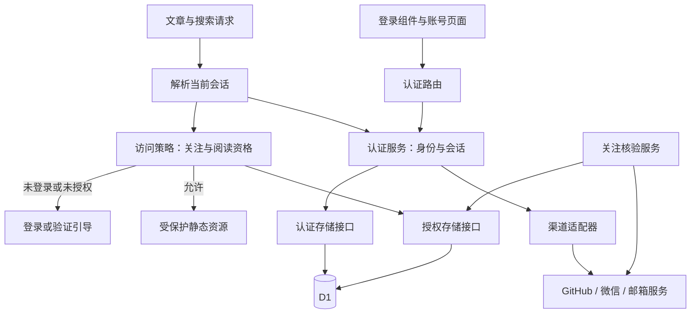

# 登录模块化与扩展方案

日期：2026-09-19。方案已开始实施：认证、会话与阅读权限已拆分，首个渠道为可重复使用的邀请码，每码对应独立账号。当前接口和运维方式见 [邀请码模块说明](../site/AUTH.md)。下文保留后续多渠道扩展设计，未列为已实现的渠道不对外开放。

## 1. 目标和核心决定

将登录做成独立模块，支持以后增加 GitHub、微信、邮箱验证码等渠道，以及账号绑定、关注验证和其他文章访问规则。

采用同一 Worker 内的模块化设计，共用现有 D1。先建立清楚的代码边界和接口；只有出现多个应用共用登录、独立团队维护或独立扩容需求时，再评估抽成服务。当前不增加独立服务器、跨域 Cookie、消息队列或通用权限平台。

三项核心决定：

1. **认证回答“你是谁”。** 负责平台身份验证、站内用户、登录会话、退出；不读取文章，也不判断关注资格。
2. **平台适配负责外部协议。** GitHub OAuth、微信扫码、邮箱验证码分别实现自己的流程，对外返回统一的已验证身份。
3. **访问权限回答“你能看什么”。** 关注资格、授权有效期及未来的会员/邀请规则归这里；登录成功不等于获得正文访问权。

第一版只实现公共接口、现有会话迁移、一个真实登录渠道和一种关注验证规则。其他渠道预留接口，在有实际需求时实现。

## 2. 当前代码与需要拆分的部分

| 当前文件/行为 | 调整方向 |
| --- | --- |
| `site/worker/auth.ts` 同时检查会话、单个 AUTH_PROVIDER 和关注授权 | 拆为认证模块的会话解析，以及访问模块的阅读授权判断 |
| `site/worker/handler.ts` 包含登录占位、退出和资源门禁 | 认证路由交给 auth，阅读门禁交给 access；主入口只装配模块和设置响应头 |
| `/api/session` 只有通过关注检查才能访问 | 新的会话查询只要求认证模块可用，使“已登录但未关注”成为可表达的状态 |
| `AUTH_PROVIDER` 只能指定一个平台 | 改为服务端平台注册表，允许同时启用多个渠道 |
| `FOLLOW_TARGET` 是一个全局字符串 | 移入具名的访问策略，明确渠道、目标和授权期限 |
| `sessions.identity_id`、`follow_status.identity_id` 已绑定具体身份 | 迁移时保留身份来源，不能退化成仅凭 user_id 查任意关注授权 |
| foundation 配置默认上锁、没有 D1 绑定 | 重构阶段继续保持；真实接入通过验收后，才切换已准备好的生产配置 |

本方案细化并调整《实施方案》中 P1 的职责划分：后续允许在验证真实身份后建立站内会话，关注授权独立决定能否阅读。原有“未获阅读授权不得返回正文”的规则保持不变。当前线上代码仍执行原有逻辑。

## 3. 模块和依赖方向



认证模块不依赖 access、文章、Astro 页面或关注目标。access 只依赖认证模块公开的 Principal 类型和会话结果，不直接读取认证模块私有表。模块业务代码不依赖 Hono Context；HTTP 适配层负责 Request/Response，D1 适配层负责 SQL。

同一平台的登录和关注核验可以共用底层 API 客户端，但公开为不同接口。新增邮箱登录不需要实现“查询关注”这种不适用的方法。

## 4. 建议目录

```text
site/worker/
  index.ts                         # Hono 装配
  handler.ts                       # 公共资源、受保护资源、统一响应头
  modules/
    auth/
      index.ts                     # 对外导出，调用方唯一入口
      contracts.ts                 # Principal、结果、适配器和存储契约
      service.ts                   # 登录完成、身份映射、会话签发
      sessions.ts                  # 会话解析、轮换、退出
      challenges.ts                # 一次性挑战与浏览器绑定
      registry.ts                  # 服务端启用的登录渠道
      http/routes.ts               # /api/auth/* 路由
      providers/
        github.ts                  # 首个渠道确定后实现
        # wechat.ts、email.ts 按需增加
      repositories/d1.ts           # 认证相关持久化
    access/
      index.ts                     # requireAccess / getAccessStatus
      contracts.ts                 # Policy、Evidence、AccessDecision
      service.ts                   # 业务访问判断
      policies.ts                  # 显式注册并启用的策略
      verifiers/                   # 关注关系等外部核验
      repositories/d1.ts           # 授权证据持久化
      http/routes.ts               # /api/access/*
  integrations/                    # 同平台共用的 API 客户端

site/src/components/auth/
  LoginPanel.astro                  # 渠道列表、提交入口、状态展示
  AccountMenu.astro                 # 当前用户与退出
site/src/pages/
  login.astro                      # 独立登录页
  access.astro                     # 阅读资格说明与验证引导
site/public/public/
  auth.js                          # 按需增加的公共登录交互
```

先在项目内部复用。以后抽包时，优先提取 auth 的契约、业务逻辑和存储接口；HTTP、UI、D1 适配仍由使用方选择。

## 5. 对外契约

以下是接口草案，用于限定职责，不是本次已实现的代码：

```ts
type Principal = {
  userId: string;
  sessionId: string;           // 非 Cookie 原始令牌；只在服务端上下文使用
  authIdentityId: string;     // 本次登录所验证的平台身份
  authenticatedAt: number;
  sessionExpiresAt: number;
};

type SessionResult =
  | { kind: 'anonymous' }
  | { kind: 'authenticated'; principal: Principal }
  | { kind: 'unavailable' };

type AuthNextStep =
  | { kind: 'redirect'; url: string }
  | { kind: 'challenge'; challengeId: string;
      presentation: 'qr' | 'code'; expiresAt: number };

type VerifiedIdentity = {
  providerId: string;
  namespace: string;          // 身份范围，如 issuer、租户或微信 AppID
  subject: string;            // 平台稳定 ID，不使用昵称作为唯一身份
  displayName?: string;
};

type AccessDecision =
  | { kind: 'allowed'; validUntil: number | null }
  | { kind: 'login_required' }
  | { kind: 'verification_required'; policyId: string }
  | { kind: 'denied' }
  | { kind: 'unavailable' };
```

认证模块对应用暴露 `beginLogin()`、`completeLogin()`、`getSession()`、`logout()`；访问模块暴露 `getAccessStatus()`、`verifyAccess()`、`requireAccess()`。业务代码不调用具体的 `github.ts`。

渠道适配器提供元信息、流程类型、发起流程、完成外部验证四项能力。回调输入按 redirect/code/qr 分型，不能要求所有渠道都实现 OAuth，也不能将任意客户端 JSON 当作 VerifiedIdentity。已验证身份只在服务端模块内部传递，不能由请求体直接构造。

共享核心负责挑战生成、浏览器绑定、到期和一次性消费；适配器负责与固定的平台端点交互和解析可信响应。PKCE 验证材料属于短期挑战状态，不能只存不可恢复的哈希，也不能发给无关浏览器。

## 6. 路由与用户流程

| 接口 | 用途 | 权限 |
| --- | --- | --- |
| `GET /api/auth/providers` | 返回可用渠道、标签和流程类型，不返回密钥 | 公开 |
| `POST /api/auth/:provider/start` | 发起登录，保存安全的站内 next 地址 | 同源检查、挑战限流 |
| `GET /api/auth/:provider/callback` | 处理重定向型平台回调 | 检查 state、浏览器绑定、平台和一次性消费；不能套用必须带 Origin 的普通 POST 规则 |
| `POST /api/auth/:provider/complete` | 完成验证码或扫码挑战 | 同源检查、浏览器绑定、单次消费、限流 |
| `GET /api/auth/challenges/:id` | 查询扫码等异步进度 | 绑定发起浏览器；知道 ID 本身不足以查询或登录 |
| `GET /api/auth/session` | 最小化的登录状态、用户展示信息 | 无会话返回 200 + authenticated=false；依赖故障返回 503 |
| `POST /api/auth/logout` | 撤销当前会话 | 同源检查；不要求具备阅读资格 |
| `GET /api/access/status` | 返回当前阅读资格和下一步操作 | 可以说明需要登录，不泄露文章信息 |
| `POST /api/access/verify` | 核验服务端配置的访问规则 | 登录、同源检查、限流；目标平台和账号不能由客户端任意指定 |

只注册当前实现的流程路由。扫码轮询、验证码入口不在首个渠道不需要时提前上线。平台事件 webhook 属于独立回调适配器，验证签名后幂等更新挑战或授权；不能替代浏览器完成步骤或直接给任意浏览器签发 Cookie。

旧的 `/api/auth/status` 在过渡期作为新渠道能力查询的兼容接口；`/api/session` 迁移为认证会话查询的兼容入口，不再被阅读资格检查包住。旧的无 provider 登录入口仅在恰好启用一个渠道时委托给该渠道，否则要求显式选择。兼容期后统一更新前端引用再移除旧入口。

用户可处于四种明确状态：

1. 未登录：显示登录渠道。
2. 已登录、未获阅读资格：显示账号和关注验证入口，可退出或管理账号。
3. 已登录、有有效资格：返回原文章，继续阅读。
4. 登录或核验暂时不可用：显示可重试提示；不给出虚假的“未关注”结论，也不返回正文。

基础页面展示的 providers 来自服务端；密钥或数据库缺失的渠道不能显示为可登录。增加一种渠道时，只新增适配器、配置、对应流程 UI 和契约测试，文章模板与阅读器不变。

## 7. 数据模型与账号边界

沿用现有表，并通过新增迁移扩展；不重写已执行过的 `0001_auth.sql`。

| 数据 | 归属与演进 |
| --- | --- |
| users | 认证模块拥有；站内稳定 ID 与停用状态 |
| identities | 认证模块拥有；唯一键扩为 provider + namespace + subject，区分不同应用/租户的同名 ID |
| sessions | 认证模块拥有；记录 user_id、auth_identity_id、签发/过期/撤销时间；只存 Cookie 令牌哈希 |
| auth_challenges | 认证模块拥有；补充用途 login/link/reauth、流程类型、回调/next、浏览器绑定及必要短期验证材料 |
| follow_status | 先由 access 模块接管，保留 identity_id、target 和到期语义；首版不为尚不存在的业务重建通用授权引擎 |
| access 证据 | 真正增加第二种规则时再迁移为具名证据：policy、身份来源、目标、核验时间、到期和撤销状态 |

**同一个站内账号下的多个平台身份，也不自动共享关注资格。** 第一版仍只接受当前会话 `authIdentityId` 对应的关注证据，保留现有防止“借用另一身份权限”的测试。

将来若产品需要“邮箱登录后使用已绑定微信的关注资格”，必须增加明确的选择和验证流程：用户在当前会话证明该微信身份，绑定动作需近期重新认证；access 显式记录此次授权选择的验证身份及策略。解绑或该身份撤销后，相应证据失效。不能简单改成按 user_id 找到任意有效关注就放行。

账号绑定作为后续里程碑实现：登录状态下重新认证两个身份，检查唯一归属，事务写入；不能根据相同邮箱或昵称自动合并账号，不能允许解绑最后一个可用登录方式。第一版多渠道可并存，但不提供隐式账号合并。

数据库写入通过仓储方法封装。一次性挑战的领取必须用带未消费/未过期条件的原子更新，并检查命中结果；两个并发回调只能有一个成功。用户、身份和会话的相关写入使用 D1 可支持的事务批处理及数据库唯一约束。注意：条件更新影响 0 行不等于 SQL 报错，不能以“批处理成功”代替挑战消费成功判断。外部授权码交换失败后要求重新发起流程，不恢复已消费的挑战。

## 8. 会话和外部凭据

继续使用现有随机不透明会话令牌和 `HttpOnly; Secure; SameSite=Lax; Path=/` 的 `__Host-` Cookie。登录成功时轮换令牌；状态变更接口做同源/CSRF 检查。退出撤销 D1 会话后清除 Cookie；数据库不可用时不能声称撤销成功。

会话期限与阅读资格期限分开配置。关注过期时保留已验证的登录身份，引导再次核验；核验窗口外拒绝阅读。默认不在每次文章或图片请求里调用第三方平台。取关发现时撤销阅读证据；暂未发现的取关只能在明确的复核窗口内失效，不能承诺即时生效。

外部 Token 与站内 Cookie 是两类凭据。首个渠道若只需登录/本次关注查询，Token 仅短暂用于服务端调用；下一次需要用户授权时明确提示。只有后台复核确实需要长期凭据时，才增加加密 Token 仓储、轮换和撤销机制，密钥放 Cloudflare Secrets。数据库中不能只有 Token 哈希却又声称可以拿它去请求平台。

OAuth 使用授权码流程，支持时采用 PKCE S256，配合一次性 state 和浏览器绑定；OIDC 渠道还需验证签名、issuer、audience、nonce 和有效期。回调必须绑定发起时的平台，next 只允许站内安全路径。协议部分使用经过验证的实现和平台文档，不自行实现密码学或通用 OIDC 协议栈。

## 9. 配置、部署和可观察性

服务端维护独立的 AuthConfig 和 AccessConfig，部署入口负责从环境变量/Secrets 解析。示意：

```ts
auth: {
  enabledProviders: ['github'],
  sessionTtlSeconds: 86400
}
access: {
  activePolicy: 'follow-owner',
  policies: {
    'follow-owner': {
      kind: 'follow', provider: 'github', target: '<待确认账号>',
      identityScope: 'current-session', verificationTtlSeconds: 3600
    }
  }
}
```

以上期限和渠道仅用于展示配置边界，接入前按用户选择确认；不是已确定的生产参数。未知渠道、未知策略、必需参数缺失都应明确报配置不可用，不能回退到允许访问。

保留 `run_worker_first=true` 和公开资源精确白名单。新增 `/login/` 及登录交互资源时逐项加入白名单，不整体放行 JS、JSON 或 `_astro/*`。认证与访问响应继续 `no-store`，前端不保存会话令牌。

先部署模块重构，维持 foundation 上锁。真实接入准备好后，在隔离的测试 Worker/D1 上验证，再创建/迁移生产 D1、注入密钥、配置真实回调；最后显式切换生产部署命令与配置。后续继续跟踪 `main` 自动构建。`deploy:foundation` 不适用于启用登录后的正式版本，不能只修改 AUTH_PROVIDER。

运行记录只保留关联 ID、渠道、阶段、结果码和耗时，设定保留期；不记录 Cookie、授权 code、Token、验证码或正文。数据库迁移优先增量兼容，出现故障可回滚 Worker 或回到 foundation 关闭阅读；旧版本不兼容新会话格式时让用户重新登录，不尝试拼接旧新权限。

## 10. 实施顺序与验收

| 阶段 | 交付 | 验收门槛 |
| --- | --- | --- |
| M1：模块拆分 | auth/access 目录、接口、D1 适配、原入口委托 | 现有权限测试全部保持；foundation 仍锁定；文章与阅读器无平台依赖 |
| M2：首个真实渠道 | 挑战/回调、身份映射、会话、D1 迁移、最小登录面板 | 真实用户登录与退出；已登录未关注不获阅读资格；回调重复、伪造、过期和跨浏览器全部拒绝 |
| M3：独立关注验证与上线 | 一个 verifier、一条策略、核验/重试 UI、生产配置 | 已关注放行；未关注/到期/撤销拒绝；平台和数据库故障不泄露正文；线上 HTML/JSON/附件一致执行门禁 |
| M4：扩展验证 | 根据下一次需求增加第二渠道，再实施账号绑定 | 新渠道不修改阅读器；渠道并存；没有邮箱自动合并或跨身份误授权 |

测试分三层：认证/访问模块单测，D1 仓储与并发挑战集成测试，真实 Worker 下的路由和浏览器端到端测试。第一渠道还需一次真实账号演练；mock 平台测试不能代替真实接入验收。

重点保留并新增的行为：

- 登录成功且没有关注证据时，账号状态可读，正文不可读。
- 同一用户的另一身份不能替当前会话满足关注条件；显式跨身份授权以后单独测试。
- 未知渠道、禁用渠道、平台 401/403/限流/超时均有明确结果，不被误判为成功。
- 并发回调、挑战重放、账号绑定冲突不重复建会话或越权合并。
- 登出、过期、停用用户和授权撤销后，直链、搜索、HEAD 请求与缓存均不泄露内容。
- 新增邮箱/扫码渠道的契约测试不依赖 OAuth 专有字段。

## 11. 开始实施前的输入

模块拆分 M1 可以先做，无需等待平台账号。

M2/M3 需要确定：首个登录渠道；关注目标及可用接口权限；正式回调域名；会话与关注复核期限。具体平台凭据在接入时配置到 Secrets，不放进方案或公开仓库。

## 12. 参考依据

- [GitHub OAuth 授权流程](https://docs.github.com/en/apps/oauth-apps/building-oauth-apps/authorizing-oauth-apps)：授权码、state、PKCE 和身份复核。
- [GitHub 关注关系接口](https://docs.github.com/en/rest/users/followers)：关注核验与平台响应语义。
- [OWASP OAuth2 指南](https://cheatsheetseries.owasp.org/cheatsheets/OAuth2_Cheat_Sheet.html)：回调绑定、PKCE 和重放保护。
- [OWASP 会话管理指南](https://cheatsheetseries.owasp.org/cheatsheets/Session_Management_Cheat_Sheet.html)：会话与访问控制的边界、Cookie 和会话生命周期。
- [Cloudflare D1 batch](https://developers.cloudflare.com/d1/worker-api/d1-database/#batch)：批处理事务及失败回滚。

模块划分、目录、接口和里程碑是本项目的设计建议；平台文档不等于这些功能已经实现。
